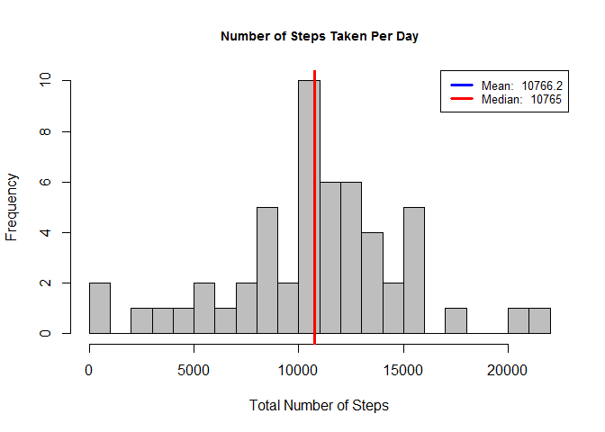
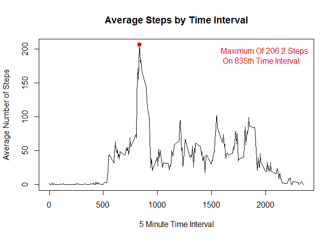
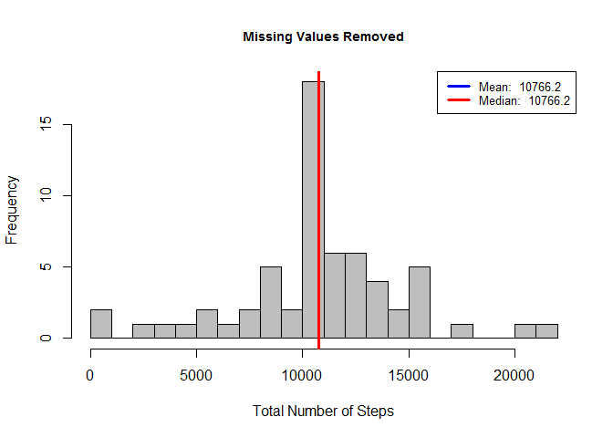

# Reproducible Research: Peer Assessment 1

## Loading and preprocessing the data

### Description of dataset
*This assignment makes use of data from a personal activity monitoring device. This device collects data at 5 minute intervals through out the day. The data consists of two months of data from an anonymous individual collected during the months of October and November, 2012 and include the number of steps taken in 5 minute intervals each day.*

The data for this assignment can be downloaded from the course web site:
Dataset: Activity monitoring data [52K]

The variables included in this dataset are:
* steps: Number of steps taking in a 5-minute interval (missing values are coded as NA)
* date: The date on which the measurement was taken in YYYY-MM-DD format
* interval: Identifier for the 5-minute interval in which measurement was taken

### Load the data 

```r
data = read.csv('activity.csv', header = T)
```

## What is mean total number of steps taken per day?
*For this part of the assignment, you can ignore the missing values in the dataset.*

### Calculate the total number of steps taken per day

```r
# compute aggregate step count by date
steps_by_day <- aggregate(steps ~ date, data, sum)
```

### Make a histogram of the total number of steps taken each day*

```r
# create a histogram function so we can call this again 
# after cleaning up the missing data
hist_steps_by_day = function(x, title){
        hist(
             x, 
             breaks = 20,
             main = title,
             xlab = 'Total Number of Steps', 
             col = 'grey',
             cex.main = .9
        )
        
        #calculate mean and median
        mean_value = round(mean(x, na.rm = TRUE), 1)
        median_value = round(median(x, na.rm = TRUE), 1)
        
        #place lines for mean and median on histogram
        abline(v=mean_value, lwd = 3, col = 'blue')
        abline(v=median_value, lwd = 3, col = 'red')
        
        #create legend
        legend('topright', lty = 1, lwd = 3, col = c("blue", "red"),
               cex = .8, 
               legend = c(paste('Mean: ', mean_value),
               paste('Median: ', median_value))
               )
}


# draw the histogram
hist_steps_by_day(steps_by_day$steps, 'Number of Steps Taken Per Day')
```

 

### Calculate and report the mean and median of the total number of steps taken per day

```r
# calculate mean and median
mean(steps_by_day$steps, na.rm = TRUE)
```

```
## [1] 10766.19
```

```r
median(steps_by_day$steps, na.rm = TRUE)
```

```
## [1] 10765
```

## What is the average daily activity pattern?

### Make a time series plot (i.e. type = "l") of the 5-minute interval (x-axis) and the average number of steps taken, averaged across all days (y-axis)

```r
steps_by_interval <- aggregate(steps ~ interval, data, mean)

#Find Interval That Has The Maximum Avg Steps
max_interval <- steps_by_interval[which.max(steps_by_interval$steps), 1]
max_steps = steps_by_interval[steps_by_interval==max_interval,]$steps

#plot the time series
plot(steps_by_interval$interval,
     steps_by_interval$steps, type = 'l',
     main = 'Average Steps by Time Interval',
     xlab = '5 Minute Time Interval',
     ylab = 'Average Number of Steps'
)

#Generate Label String
max_lab = paste('Maximum Of ', round(max_steps, 1), ' Steps \n On ', max_interval, 'th Time Interval', sep = '')

#Collect Cooridinates of The Max Interval For Graphing
points(max_interval,  max_steps, col = 'red', lwd = 3, pch = 19)

#Add Label To Annotate Maximum # Steps And Interval
legend("topright",
       legend = max_lab,
       text.col = 'red',
       bty = 'n'
       )
```

 


### Which 5-minute interval, on average across all the days in the dataset, contains the maximum number of steps?
Answer: the 835th interval as shown in the plot

## Imputing missing values
*Note that there are a number of days/intervals where there are missing values (coded as NA). The presence of missing days may introduce bias into some calculations or summaries of the data.*

### Calculate and report the total number of missing values in the dataset (i.e. the total number of rows with NAs)

```r
# count NAs
sum(is.na(data$steps))
```

```
## [1] 2304
```

### Devise a strategy for filling in all of the missing values in the dataset.
We will replace NAs with the mean for that day.

### Create a new dataset that is equal to the original dataset but with the missing data filled in.

```r
# copy original data set and replace missing data with the mean
data_naremoved <- transform(data, steps = ifelse(is.na(data$steps), steps_by_interval$steps[match(data$interval, steps_by_interval$interval)], data$steps))
```

### Make a histogram of the total number of steps taken each day and Calculate and report the mean and median total number of steps taken per day. 
**Note: Mean and Median Are Reported In Legend Of Histogram**

```r
# compute aggregate step count by date
steps_by_day_i <- aggregate(steps ~ date, data_naremoved, sum)

# draw the histogram
hist_steps_by_day(steps_by_day_i$steps, 'Missing Values Removed')
```

 

### Do these values differ from the estimates from the first part of the assignment? 
Answer: Yes, as shown below

```r
# compute mean and median
mean(steps_by_day$steps, na.rm = TRUE)
```

```
## [1] 10766.19
```

```r
median(steps_by_day$steps, na.rm = TRUE)
```

```
## [1] 10765
```

```r
# compute mean and median after filling in missing data
mean(steps_by_day_i$steps, na.rm = TRUE)
```

```
## [1] 10766.19
```

```r
median(steps_by_day_i$steps, na.rm = TRUE)
```

```
## [1] 10766.19
```

### What is the impact of imputing missing data on the estimates of the total daily number of steps?
Answer: The mean and median are now equal reflecting a more symmetrical distribution.

## Are there differences in activity patterns between weekdays and weekends
Answer: Yes, weekday activity is more concentrated in the morning, weekend activity is more evenly spread out throughout the day

### Create a new factor variable in the dataset with two levels - "weekday" and "weekend" indicating whether a given date is a weekday or weekend day.

```r
# add a field indicating if the day is a weekday or weekend
data_naremoved$dw = ifelse(weekdays(as.Date(data_naremoved$date)) %in% c('Saturday','Sunday'),"Weekend","Weekday")
```

### Make a panel plot containing a time series plot (i.e. type = "l") of the 5-minute interval (x-axis) and the average number of steps taken, averaged across all weekday days or weekend days (y-axis). 

```r
# compute the steps by interval on the imputed data
steps_by_interval_i <- aggregate(steps ~ interval + dw, data_naremoved, mean)

# load the lattice library
library(lattice)

# draw the time series plot
xyplot(steps_by_interval_i$steps ~ steps_by_interval_i$interval|steps_by_interval_i$dw,
       main="Average Steps per Day by Interval",
       xlab="Interval", 
       ylab="Steps",
       layout=c(1,2), 
       type="l")
```

 
